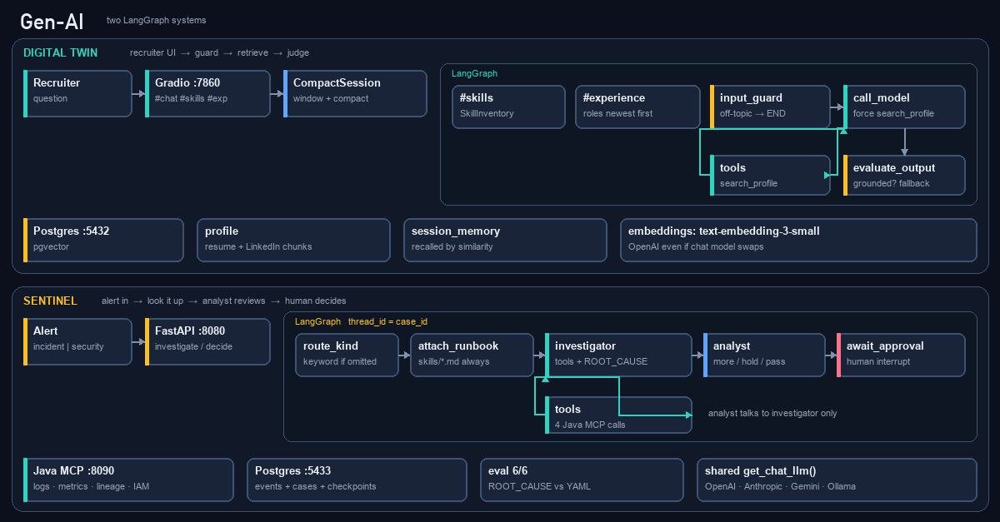

# Chandra Peravelli — GenAI work sample

Staff software engineer (Cloudera, Target, Best Buy). This repo is what I send with applications: two small systems, not a chatbot demo.

Each project has its own README for architecture, how to run it, and the bugs I hit. This file is only the map.



**LinkedIn:** [linkedin.com/in/chandrakanthperavelli](https://www.linkedin.com/in/chandrakanthperavelli)

---

## Projects


|                                            |                      |                                                                                                                                                                                                                     |
| ------------------------------------------ | -------------------- | ------------------------------------------------------------------------------------------------------------------------------------------------------------------------------------------------------------------- |
| [digital-twin-agent](./digital-twin-agent) | Interactive resume   | Recruiter asks about roles and skills. Answers come from resume/LinkedIn chunks in Postgres + pgvector, not from the model inventing a bio. Gradio UI, input/output guards, memory compact.                         |
| [sentinel-agent](./sentinel-agent)         | Retail investigation | Alert in, Java MCP tools, analyst reviews the draft, human accepts or rejects. Incident and security share one graph. Eval 6/6 on six seeded faults. |


Read those READMEs. Do not start from here if you want to run something.

---

## What is actually in here

Not a survey of GenAI. Only what the code does.


| Topic              | Where     | What you will see                                                                                 |
| ------------------ | --------- | ------------------------------------------------------------------------------------------------- |
| LangGraph          | both      | Twin: route chat vs `#skills` / `#experience`. Sentinel: investigator ⇄ tools; analyst talks only to investigator; human approves the investigator. |
| Analyst agent      | sentinel  | Background reviewer. No tools. Notes go to the investigator only. Promo `$0` without `discount_bps` is `more`. Human never approves the analyst. |
| RAG / pgvector     | twin      | PDF chunk → embed → top-k. The chat model sees retrieved text, not the whole resume.              |
| Tools              | both      | Twin: `search_profile` is retrieval. Sentinel: four Java MCP tools (logs, metrics, lineage, IAM). |
| MCP                | sentinel  | Spring AI 2.0 on `:8090`. Same methods on `GET /tools/...` for curl.                              |
| Human approval     | sentinel  | LangGraph `interrupt`. Checkpoint in Postgres. One decide path for incident and security.         |
| Playbooks / skills | sentinel  | Markdown how-to, attached by a graph node (not a model choice). Keyword match, six files.         |
| Guardrails         | twin      | LLM input gate (on-topic?) and output judge (grounded?). Fail → fixed fallback.                   |
| Memory             | twin      | Sliding window + LLM compact + vector recall of older turns.                                      |
| Eval               | sentinel  | Six YAML faults, compare `ROOT_CAUSE` to `expected.root_cause`. Last run 6/6.                     |
| Multi-provider LLM | `shared/` | OpenAI / Anthropic / Gemini / Ollama via `get_chat_llm()`.                                        |
| UI                 | twin      | Slack-style Gradio. Sentinel is curl + `GET /cases`.                                              |


Incident vs security is two **policies** on one graph, not two approval stacks.

---

## Shared

- **Env:** `[.env.example](./.env.example)` is what git tracks (provider, model, empty key slots). Copy it to `.env` and fill keys on your machine. `.env` is gitignored. Chat model: `LLM_PROVIDER` / `LLM_MODEL`. Factory lives in `[shared/](./shared)` (`get_chat_llm()`).
- **Two Postgres boxes.** Twin is `:5432` / `digital_twin` (pgvector). Sentinel is `:5433` / `sentinel` (events, cases, graph checkpoints). Separate compose files on purpose.
- **Docker** for Postgres. Sentinel also needs **Maven** for the MCP on `:8090`.

### uv and Python

Neither project uses a global `pip install`. [uv](https://docs.astral.sh/uv/) creates the venv and runs the scripts. If you do not have Python 3.12, uv will fetch it.

```bash
# macOS / Linux
curl -LsSf https://astral.sh/uv/install.sh | sh

# Windows (PowerShell)
# irm https://astral.sh/uv/install.ps1 | iex

# if `python3 --version` is missing or older than 3.12
uv python install 3.12
```

Then, in the project directory:

```bash
uv sync                          # .venv + lockfile
uv run <script>                  # uses that venv, not whatever `python` is on PATH
```

**digital-twin-agent**

```bash
cd digital-twin-agent
uv sync
uv run python rag.py             # ingest PDFs
uv run python app.py             # Gradio :7860
```

**sentinel-agent**

```bash
cd sentinel-agent
uv sync
uv run python -m generator emit --all
uv run python -m generator load --all
uv run python -m agent.eval
uv run uvicorn api.main:app --port 8080
```

Full steps (Docker, keys, Java MCP) are in each project README.

### Switch the chat model

Graphs call `get_chat_llm()` in `[shared/shared/config.py](./shared/shared/config.py)`. You do not edit `graph.py` to change vendors. Set values in the **local** `.env` (copy of `.env.example`). Restart the process after you change it — the factory caches the first client.


| `LLM_PROVIDER`       | Default `LLM_MODEL` | Key                 | Extra package (once per app)              |
| -------------------- | ------------------- | ------------------- | ----------------------------------------- |
| `openai` (default)   | `gpt-4.1-mini`      | `OPENAI_API_KEY`    | already in both apps (`langchain-openai`) |
| `anthropic`          | `claude-sonnet-4-5` | `ANTHROPIC_API_KEY` | `uv add langchain-anthropic`              |
| `gemini` or `google` | `gemini-2.0-flash`  | `GEMINI_API_KEY`    | `uv add langchain-google-genai`           |
| `ollama`             | `llama3.1`          | none (local)        | `uv add langchain-ollama`                 |


```bash
# OpenAI (what I run day to day)
LLM_PROVIDER=openai
LLM_MODEL=gpt-4.1-mini
OPENAI_API_KEY=sk-...

# Same graphs, Google model instead
LLM_PROVIDER=gemini
LLM_MODEL=gemini-2.0-flash
GEMINI_API_KEY=...

# Anthropic
LLM_PROVIDER=anthropic
LLM_MODEL=claude-sonnet-4-5
ANTHROPIC_API_KEY=...

# Local
LLM_PROVIDER=ollama
OLLAMA_MODEL=llama3.1
OLLAMA_BASE_URL=http://localhost:11434
```

Then in the project you are running:

```bash
cd sentinel-agent          # or digital-twin-agent
uv add langchain-google-genai    # only if you picked gemini
```

This is a **LangChain chat wrapper** swap, not “OpenAI’s Python SDK pointed at Gemini.” One provider at a time for chat. A new vendor that is not in that table needs a new `if` in `get_chat_llm()`.

**Twin only:** embeddings stay OpenAI (`EMBEDDING_MODEL=text-embedding-3-small`). You can run the resume UI on Gemini and still need `OPENAI_API_KEY` for `rag.py` / `search_profile`. Sentinel has no embeddings — a Gemini key is enough for investigate.

---

## About me

Staff Software Engineer. Recent work: data-governance platforms (Cloudera), enterprise search and automation (Target), microservices (Best Buy). I care about retrieval quality, tool contracts, and whether the system can say it does not know instead of making something up.

If you are hiring for GenAI / platform / backend roles: the code is the take-home I would rather you read than a slide deck.