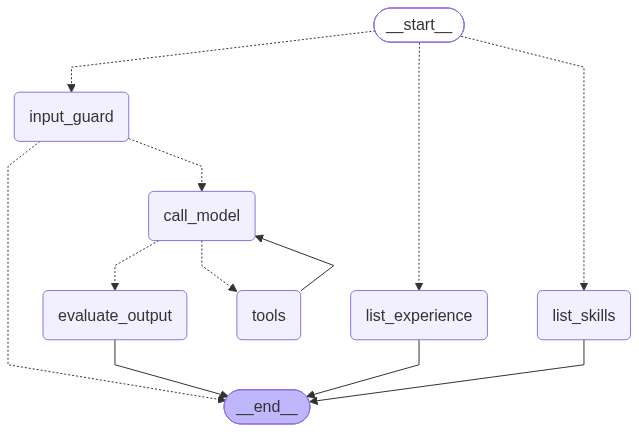

# Interactive Resume (Digital Twin)

A recruiter-facing agent that answers only from Chandra Peravelli’s resume and LinkedIn profile.

One of two projects in the [GenAI portfolio](../README.md) (the other is [sentinel-agent](../sentinel-agent)). The UI is a Slack-like Gradio workspace (`#interactive-resume`, `#experience`, `#skills`). The backend is a LangGraph state machine over RAG in Postgres + pgvector.

## What it proves

- **RAG, not a stuffed prompt.** Resume/LinkedIn PDFs are chunked (~800 tokens, 150 overlap), embedded with `text-embedding-3-small`, and stored in pgvector. The model sees top-k chunks, not the whole document.
- **LangGraph routing.** Chat goes through a guard and a judge. `#skills` and `#experience` are their own nodes with structured output. Every node is async (`ainvoke` / `asyncio.to_thread`) so Gradio can hold many in-flight turns.
- **Tools return retrieval, not canned facts.** `search_profile` always calls `retrieve()`.
- **Memory that survives a long screen.** Last *n* messages stay in the window; overflow is LLM-compacted and written to a separate `session_memory` collection, then recalled by similarity.
- **Two LLM judges.** Input: is this a professional-background turn? Output: is the answer grounded, on-topic, and recruiter-safe? Failures become a fixed fallback — recruiters never see a hallucinated job title.
- **Context engineering.** System prompt and “do not invent / do not cite [1]” rules are explicit in `context.py`. Grounding is tool results, not a stuffed resume.

## Graph

Compiled from the running `StateGraph` (`graph.get_graph().draw_mermaid_png()`):



```python
from IPython.display import Image, display
from graph import build_graph

display(Image(build_graph().get_graph().draw_mermaid_png()))
```

Or write the PNG: `uv run python draw_graph.py`

`#skills` builds a `SkillInventory` (category → names).  
`#experience` builds an `ExperienceSummary` (overview + roles newest first).  
Both format as Slack-style markdown, not a wide table.

## CompactSession vs the graph

The graph is **stateless between calls**. `CompactSession` is the source of truth. We pass a snapshot in and write the result back.

**Who uses `CompactSession`**

Only the **app layer** — not the graph.

| Caller | Uses `CompactSession`? |
|---|---|
| `ask.py` (`ask_stream`, `ask`, `__main__`) | Yes |
| `app.py` (Gradio) | Yes — one in `gr.State`, passed into `ask_stream()` |
| `graph.py` | **No.** It never imports `memory` |
| `tools.py` / `rag.py` | No |

The graph only sees `TwinState["messages"]` for **one** `astream` / `ainvoke`.

**How they stay in line**

They are **not** the same object. `ask_stream()` copies **out**, then copies **back**.

```text
CompactSession.messages          TwinState.messages
        │                                │
        │  1. add(HumanMessage)          │
        │     (+ recall / _compact)      │
        │                                │
        │  2. get_messages() ──────────► │  astream({messages: snapshot})
        │                                │  call_model / ToolNode append
        │                                │
        │  3. replace(last_state["messages"])
        │     ◄───────────────────────── │
        │     _compact() again           │
```

```46:66:ask.py
    if route == "chat":
        await session.add(HumanMessage(content=question))

    streamed = ""
    last_state = None
    async for mode, data in get_graph().astream(
        {"messages": session.get_messages(), "route": route},
        stream_mode=["custom", "values"],
    ):
        ...
    await session.replace(last_state["messages"])
```

- **Into the graph:** whatever the session has *after* `add` (system, recap, maybe recall, history, new user text).
- **Out of the graph:** that list **plus** this turn’s `AIMessage` / `ToolMessage`s (and token chunks on the `custom` stream).
- **`replace`:** the session’s list **becomes** the graph’s list, then `_compact` may shrink it and update `self.summary`.

If you skip `replace`, the session never sees the tool results or the answer. If you skip `get_messages()`, the graph starts empty and forgets the last turn.

`add_messages` in the graph only appends **during that stream**. It does not update `CompactSession` live. Alignment happens only at those two `ask_stream()` lines.

**Interview one-liner:** the graph is stateless between calls; `CompactSession` is the source of truth; we pass a snapshot in and write the result back.

## Layout

```
digital-twin-agent/
  app.py          Gradio UI (channels, composer, typing, redo)
  ask.py          async entry — session + graph.astream (token stream)
  graph.py        StateGraph (async nodes)
  guardrails.py   LLM input verdict
  evaluator.py    LLM output verdict + fallback
  context.py      system prompt + token helpers
  rag.py          load → chunk → embed → retrieve
  tools.py        search_profile, compact_memory
  memory.py       CompactSession + session_memory vectors
  skills.py       #skills node
  experience.py   #experience node
  config.py       .env + get_chat_llm() factory
  draw_graph.py   writes docs/graph.png
  docs/           compiled mermaid PNG
  data/           resume + LinkedIn PDFs
  static/         Slack theme + avatars
  docker-compose.yml   pgvector/pg16 (port 5432)
```

## Setup

**Need:** [uv](https://docs.astral.sh/uv/), Docker. Embeddings stay on OpenAI, so `OPENAI_API_KEY` is required even if chat uses another provider. If `uv` or Python 3.12 is missing, see the [repo README](../README.md#uv-and-python). Use `uv sync` / `uv run`, not a global `pip`.

```bash
cd digital-twin-agent

# Keys live at the Gen-AI repo root so later projects can share them
cp ../.env.example ../.env
# set OPENAI_API_KEY in ../.env — do not put keys in *.env.example
# optional: LLM_PROVIDER=openai|anthropic|gemini|ollama  and LLM_MODEL

docker compose up -d
uv sync
uv run python rag.py      # ingest data/*.pdf into collection "profile"
uv run python app.py      # http://127.0.0.1:7860
```

Re-running `rag.py` **appends** chunks. Wipe the `twin_pg` volume if you need a clean index:

```bash
docker compose down -v
docker compose up -d
uv run python rag.py
```

## Configure the LLM

Full table and copy-paste examples (OpenAI, Gemini, Anthropic, Ollama): [Switch the chat model](../README.md#switch-the-chat-model).

`config.get_chat_llm()` is what the graph, guards, skills, experience, and memory compact all call. Restart `app.py` after changing `.env`. Embeddings stay on OpenAI (`EMBEDDING_MODEL`) so the pgvector index does not have to be rebuilt when you swap the chat model.

## Design notes (the “why”)

| Choice | Why |
|---|---|
| pgvector in Postgres | Same store for profile RAG and compacted session memory; two collections, one operational model |
| Force `search_profile` on each new chat turn | Interactive resume is a retrieval product. “Hi” still has to introduce the real person |
| LLM guard instead of keyword lists | Follow-ups like “what about there?” are on-topic only with thread context |
| Evaluator as a swap, not a rewrite | If the judge fails, we do not ask the same model to “try again and be honest” |
| Dedicated skills/experience nodes | Structured lists beat hoping the chat path formats a table |
| `gpt-4.1-mini` | Tool-calling quality above nano-tier, cost below flagship |
| Async graph (`astream`) | Tokens stream to Gradio; LLM + RAG waits do not block the event loop |
| Snapshot in / write back | Graph never owns memory. `CompactSession` is the source of truth between turns |

## Production considerations (not all shipped)

What I would add before putting this on a public URL:

- **Idempotent ingest** — hash chunks; do not duplicate on every `rag.py` run
- **Tracing** — LangSmith (or OpenTelemetry) on guard / retrieve / judge latency and fail reasons
- **Eval set** — fixed recruiter questions with expected employers/skills; fail the build if groundedness drops
- **Auth + rate limits** — this is a personal brand surface
- **A real API** — Gradio is the recruiter UI; FastAPI would `await ask()` for other clients
- **MCP** — expose `search_profile` as a tool other agents can call (dependency is present; server is not wired yet)

## License

Personal portfolio sample. Resume/LinkedIn PDFs are mine; do not republish them as yours.
