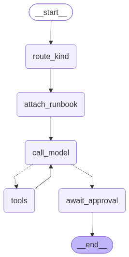

# Sentinel

You hand it an alert. It investigates a fake retailer (logs, metrics, lineage, IAM), writes a `ROOT_CAUSE`, and stops until a human accepts or rejects it. It is not a chatbot.

I built this after [digital-twin-agent](../digital-twin-agent) — same repo, different job. The twin answers resume questions from pgvector. This one has to *look things up* and not invent a cause.

Six scenarios in `world/scenarios/`, each with a known root cause. Eval is “did the last `ROOT_CAUSE:` line overlap the YAML enough?” Last run: **6/6**.

Two workflows, one graph: `kind` is `incident` or `security`. A keyword router picks it if you omit it.

---

## Graph



```text
START → route_kind → attach_runbook → call_model ⇄ tools → await_approval → END
```

- **route_kind** — `incident` vs `security` from the alert text, unless the client already sent `kind`.
- **attach_runbook** — always stuffs a playbook from `skills/*.md`. Not a model choice. I tried it as a tool first; the model skipped it and guessed Prometheus names.
- **call_model / tools** — four tools only, served by the Java MCP: `search_logs`, `get_metrics`, `get_downstream`, `lookup_iam`.
- **await_approval** — LangGraph `interrupt`. The checkpoint is in Postgres, so killing uvicorn does not lose the case.

`thread_id` is the `case_id`. There is also a `cases` table so you can list investigations without digging through checkpoint blobs.

Regenerate the PNG: `uv run python draw_graph.py`.

---

## How the pieces split

Layers, top to bottom. The agent only talks to the MCP. It does not know if a row came from a JSONL file or a Kafka consumer.

```text
  alerts / curl / eval
            │
            ▼
     FastAPI  :8080          investigate, decide, cases
            │
            ▼
     LangGraph               route → playbook → tools ⇄ model → approve
            │
            ▼
     Java MCP :8090          search_logs, get_metrics, get_downstream, lookup_iam
            │
            ▼
     Postgres :5433          events + cases + checkpoints     ← query layer
            ▲
            │  (today: generator load)
            │  (next:  Kafka consumer)
            │
     JSONL files             data/generated/*.jsonl           ← what I ship
     Kafka  (not running)    logs / metrics / auth / alerts   ← production ingest
            ▲
            │
     generator               YAML → Event                     ← same object either sink
     world/                  services, lineage, six faults
```

| Piece | Layer | What it is |
|---|---|---|
| `world/` | domain | The retailer. Services, lineage, six faults. |
| `generator/` | emit | YAML → `Event`. `Sink` protocol: `JsonlSink` now, `KafkaSink` later. `emit()` does not change. |
| JSONL | laptop ingest | Files under `data/generated/`. Fine for eval. Not how a store pages in. |
| Kafka | stream ingest | Not running. Same `Event` JSON on a topic. Consumer writes `events`. |
| Postgres `:5433` | store | `events` + `cases` + LangGraph checkpoints. Not the twin’s `:5432` box. |
| `mcp-java/` | tools | Spring AI 2.0, port **8090**. Reads the store + `lineage.yaml`. |
| `skills/` | how-to | Keyword match on `skills/*.md`. Six files. |
| `agent/` | reason | Graph, router, prompts, eval. |
| `api/` | edge | Events in (today), investigate, decide, list cases. |

The model never sees the YAML `expected.root_cause`. That is only for eval.

---

## Run it

Docker, Maven, and a chat key. Copy [`../.env.example`](../.env.example) to `../.env` and fill keys there. `.env` is not committed.

If `uv` or Python 3.12 is missing, install them from the [repo README](../README.md#uv-and-python). Do not `pip install` into a random interpreter — `uv sync` / `uv run` own the venv.

Chat model is `LLM_PROVIDER` in `../.env`. Default is OpenAI. To use Gemini (or Anthropic / Ollama) see [Switch the chat model](../README.md#switch-the-chat-model) — one env change, `uv add` the extra package, restart. You do not edit the graph.

```bash
cd sentinel-agent
docker compose up -d          # Postgres 16 on localhost:5433  (user/db: sentinel)

# generate JSONL, then insert into Postgres
uv sync
uv run python -m generator emit --all
uv run python -m generator load --all
```

Java tools (needs the DB). This machine’s `~/.m2/settings.xml` mirrors everything to Cloudera Nexus, which I cannot reach from home — the project `.mvn/settings.xml` forces Maven Central.

```bash
cd mcp-java
./start.sh          # :8090  (./stop.sh to kill it)
```

API (optional — eval does not use it):

```bash
cd sentinel-agent
uv run uvicorn api.main:app --port 8080
```

```bash
# investigate, then approve
curl -s localhost:8080/investigate -H 'content-type: application/json' \
  -d '{"alert":"checkout p99 is high"}'
# → case_id, status=pending_approval, kind=incident

curl -s localhost:8080/investigate/CASE_ID/decision -H 'content-type: application/json' \
  -d '{"approved":true,"decided_by":"you"}'

curl -s localhost:8080/cases
```

Omit `kind` and the router decides. `login failure rate is high` should come back `security`.

Eval (Postgres + Java up; uvicorn can be down):

```bash
uv run python -m agent.eval
```

Auto-approves so it does not hang on the interrupt.

---

## Things I broke and then fixed

**The model would not open the playbook.** I exposed `search_runbooks` as a tool and asked nicely in the system prompt. It went straight to `get_metrics("request_duration_p99")`, which this world does not emit. Fix: `attach_runbook` is a graph node. It always runs. Skills tell it to search `HikariPool`, not Prometheus names.

**Approval died on reload.** First checkpointer was `InMemorySaver`. I hit save in the API, uvicorn `--reload` recycled the process, `thread_id` pointed at nothing. `PostgresSaver` + `ConnectionPool` on `DATABASE_URL`. `get_graph()` builds it once.

**Promo eval was empty logs, 4/6.** `search_logs` window was “last 15m from `MAX(timestamp)` on the whole table.” All six scenarios live in one `events` table. Newest rows were PCI / service-account at 22:22. Promo signatures sat at ~21:56. `discount_bps` came back `[]`, the model said “full price,” grade wanted `10000`. Fix: lookback from the newest event *for that service*. Restart Java after you change `EventStore` — Spring does not hot-reload that.

**Maven could not see Spring Boot.** Parent POM 404’d on Cloudera Nexus. Project-local `.mvn/settings.xml` + `maven.config` pin Central.

**`ts` vs `timestamp`.** Generator field and the `events` column did not match. Inserts looked fine until the Java side selected `timestamp`.

**Shared `.env` loaded from site-packages.** `uv` installs `shared` editable. `Path(__file__)` in that package is not the repo. `REPO_ROOT` is `project_root.parent` now.

**I wired the approval edges wrong the first time.** `tools_condition` → `END` skipped the interrupt. The real split is `_after_model`: tools or `await_approval`. Resume is `Command(resume={"approved": bool})`.

**Two Postgres compose files.** I almost merged twin + sentinel into one docker-compose. They stay separate. Twin is `:5432` / `digital_twin`. Sentinel is `:5433` / `sentinel`.

---

## Kafka layer (designed, not running)

`generator/sinks.py` already has a `Sink` protocol: `write(event)` / `close()`. `JsonlSink` is the only implementation. The comment on the file is the plan: add `KafkaSink` without touching `emit()`.

**Today**

```text
scenario YAML  →  emit()  →  JsonlSink  →  *.jsonl  →  load  →  events
```

Replayable. Git-friendly. Eval does not need a broker.

**What I would add**

```text
scenario YAML  →  emit()  →  KafkaSink  →  topic sentinel.events
real services  ───────────►  same topic (or logs / metrics / auth split)
                                  │
                                  ▼
                           consumer (Java or Python)
                                  │
                                  ▼
                              events table
                                  │
                                  ▼
                           MCP tools (unchanged)
```

Split topics when it earns it, not before:

| Topic | Who writes | Who reads |
|---|---|---|
| `sentinel.events` | generator, later the fake services | consumer → `events` |
| `sentinel.alerts` | a detector / pager | API or a worker calls `start_case` |
| `sentinel.cases` | decide path | audit / another team’s SIEM |

Key the produce on `service` so one noisy checkout host does not starve login. Consumer is idempotent on `(timestamp, service, message)` or an event id — `emit --all` will run twice.

I would put Kafka in `docker-compose` next to Postgres when I write `KafkaSink`, not as an empty container “for the README.” The MCP still queries Postgres. Kafka is how rows *arrive*, not a second search engine. If playbooks outgrow keyword match, I would use Postgres `tsvector` before adding another store.

MinIO is still skipped. Kafka is the one leftover from the original sketch that matches the `Sink` I already wrote.

---

## Layout

```
sentinel-agent/
  world/           services.yaml, lineage.yaml, scenarios/*.yaml
  skills/          six playbooks
  generator/       emit JSONL
  mcp-java/        Spring AI MCP + GET /tools curl facade
  agent/           graph, router, tools, eval
  api/             FastAPI
  data/generated/  JSONL (gitignored)
```

Tool contract for humans: [`mcp-java/README.md`](mcp-java/README.md). The model sees tool annotations + the playbook, not that file.

---

## Improvements I would make next

Small things that would make the demo less fragile, in the order I would actually do them:

- **Kafka after files.** `emit --all` / `load --all` is the laptop path. Next is `KafkaSink` + one consumer into `events`. `emit()` stays the same. Eval can keep using files.
- **Auth on decide.** `POST /investigate/{id}/decision` is open. Anyone who can hit 8080 can accept a PCI finding. Even a shared token is better than nothing.
- **Honest eval.** Token overlap at 40% is how I got 6/6. It still lets a vague sentence pass and fails a correct one that used different words. I would grade required *facts* (`discount_bps=10000`, `Hikari`, `svc-analytics`) instead of bag-of-words.
- **Router / playbooks that do not lie at scale.** Keywords are fine for six alerts. Next step is Postgres `tsvector` on the skills.
- **One write for a case.** `start_case` updates the graph checkpoint *and* the `cases` table. If the second write dies you have a thread with no row. Same transaction, or the API reads checkpoint first.
- **Schema migrations.** `CREATE IF NOT EXISTS` on startup is how I avoided Alembic. It will not rename a column twice.
- **Timeouts and a dead MCP.** `tools.py` is a bare HTTP call. Java down = the model sits there. Hard timeout, surface “tools unavailable,” do not invent a cause.
- **A thin UI.** Curl is the product right now. A case list + approve/reject is enough. I would not start with Slack until the API is authenticated.

---

## What “enterprise / production” actually means here

This is a laptop loop: compose Postgres, Maven on 8090, uvicorn, a seeded world. Shipping it next to a real retailer is a different system. The pieces I would not skip:

**Identity and audit.** SSO on the API. `decided_by` is a string I typed in curl. Production needs the IdP subject, time, the exact `ROOT_CAUSE` they signed, and an immutable audit row. Security cases should require a different role than checkout latency. Eval’s auto-approve would be a fireable default.

**The tools are the blast radius.** The Java process can read whatever is in `events` and `lineage.yaml`. In a real shop that becomes Splunk / Datadog / an IAM API. Those calls need service identity, scoped credentials, allowlisted services, row limits, and redaction (PCI in the prompt is the whole point of the pci scenario — you do not dump PANs into the chat model). Log lines can also *prompt-inject* the agent. Treat tool output as untrusted text.

**Human approval is the product, not a checkbox.** Interrupt + Postgres checkpoint is the right shape. Production adds: SLA on pending cases, notify on-call, expire or escalate, two-person rule on anything that would page a customer or lock an account. Do not let the graph take an action (disable a user, rotate a secret) without that path — right now it only writes a sentence, which is why I was willing to auto-approve in eval.

**Ops around the graph.** One process, one `get_graph()` singleton, no queue. You want: a worker pool, `thread_id` that survives multiple replicas, LangSmith (or equivalent) traces, token/cost caps per case, retries with jitter on MCP, and a circuit breaker so a wedged Java box does not take the API with it. `--reload` does not exist in prod; I already learned why InMemorySaver cannot either.

**Data path / Kafka.** JSONL is the laptop source of truth. Production is a bus: producers (services, the generator, an alert source) → Kafka → consumer → the store the MCP already queries. The graph does not subscribe to Kafka. If the broker is down, investigations still run on whatever is already in Postgres; you just stop getting new rows. Compact, retain, and ACL the topics like any other log pipeline — `sentinel.events` will grow PCI-shaped text. Do not run the twin’s pgvector and this events DB as one “GenAI postgres.” Different lifetime, different access. The consumer is the only new writer to `events`; FastAPI `POST /events` is the sync stand-in I have now.

**Change management.** Playbooks will rot. Version them, review them like code, and keep eval as a gate on the YAML ground truth. If a skill change drops you under 6/6, that is a failed deploy, not a model vibe.

I would call it production when a stranger cannot approve a case, a tool cannot leak a card number, and I can explain every `ROOT_CAUSE` from the tool traces.
